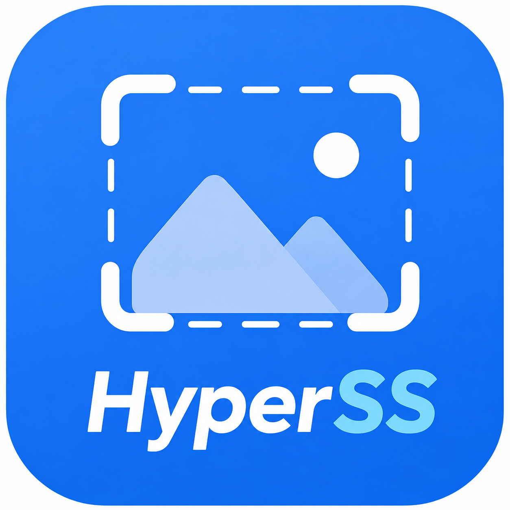

<div align="center">



# HyperSS

**智能长截图 · 项目化管理 · 本地优先**

[]()
[-green)]()
[]()

一款 Android 端智能长截图工具，核心差异化在于把截图当作**项目**来管理：每次截图任务隶属于一个项目，图片按 `项目前缀 + 4 位序号`（如 `zc0001` ~ `zc9999`）自动命名归档，而非散落在系统相册。

</div>

---

## ✨ 特性

- **四种截图模式合一**
  - 🔄 自动滚动长截图（无障碍手势驱动）
  - ✋ 手动滚动截图（逐帧自己滚，App 负责拼接）
  - 📏 自定义步长滚动截图（步长可调，适配任意应用）
  - 🎯 双点取距滑动截图（标定两点自动计算滚动距离）
- **项目化管理**：截图按项目归档、自动编号、支持批量整理与阅读视图
- **本地优先、零采集**：全部截图与拼接均在设备本地完成，不申请网络权限，无任何数据上报
- **Rust 核心**：图像拼接、编解码、项目数据层由 Rust 实现（UniFFI 绑定），兼顾性能与内存安全
- **HyperOS 风格 UI**：Jetpack Compose + [miuix](https://github.com/miuix-kotlin-multiplatform/miuix) 组件库，悬浮球 + 玻璃拟态视觉 + 毛玻璃标题栏

## 🏗️ 技术栈

| 层 | 技术 |
|---|---|
| UI | Kotlin + Jetpack Compose + miuix（minSdk 33 / targetSdk 37） |
| 核心 | Rust（`hyperss-core`，UniFFI 生成 Kotlin 绑定，JNA 调用） |
| 数据层 | SQLite（rusqlite bundled）+ 本地文件系统 |
| 构建 | Gradle + cargo-ndk 交叉编译（仅 64 位：arm64-v8a / x86_64） |

## 📂 目录结构

```
├── rust-core/              # Rust workspace
│   ├── hyperss-core/       # 主业务 crate（capture / stitch / project / session / storage / config）
│   └── uniffi-bindgen/     # bindgen 可执行入口
├── android-app/            # Android Gradle 工程
│   ├── app/                # UI + 系统服务（无障碍 / MediaProjection / 悬浮窗）
│   └── core-bindings/      # UniFFI 生成的 Kotlin 绑定模块（构建时生成）
├── docs/                   # 开发文档
└── sample-data/            # 脱敏合成示例数据（开发调试用）
```

## 🔨 从源码构建

### 环境要求

- Android Studio + Android SDK（API 37）+ NDK
- JDK 17
- Rust 工具链 + [cargo-ndk](https://github.com/bbqsrc/cargo-ndk)：

```bash
rustup target add aarch64-linux-android x86_64-linux-android
cargo install cargo-ndk
```

### 构建步骤

```bash
cd android-app
# Rust 交叉编译与 UniFFI 绑定生成已接入 Gradle 流水线，直接执行即可
./gradlew :app:assembleDebug     # Debug 版
./gradlew :app:assembleRelease   # 正式版（未配置签名密钥时自动回退 debug 签名）
```

产物位于 `android-app/app/build/outputs/apk/`。**仅打包 64 位 ABI**（arm64-v8a / x86_64）。

> 修改 Rust 代码后建议先运行测试：`cd rust-core && cargo test -p hyperss-core`

### 版本号

版本统一由 `android-app/version.properties` 管理，当前为 **0.0.9beta**，APK `versionName` 与应用内"关于"页显示一致。

## 📡 发布流程（维护者）

推送 `v*` 标签触发 `.github/workflows/release.yml`，自动完成 64 位交叉编译、签名（密钥经 GitHub Secrets 注入，不入库）并上传 APK 产物。

## 🔒 隐私承诺

- 所有截图、拼接、存储均在设备本地完成，**不申请网络权限**
- 正式版不集成任何数据上报 / 统计 SDK
- 开发协作同样遵守隐私红线：真实用户截图、数据库、签名密钥严禁进入公开仓库（见 `.gitignore` 与 CI 隐私扫描工作流）

## 🤝 参与贡献

欢迎通过 Issue / Pull Request 参与开发。提交前请确保：

1. 不包含任何真实用户数据、日志、密钥文件
2. Rust 侧改动通过 `cargo test`
3. Android 侧可正常 `assembleDebug`

## 📄 开源协议

[MIT License](LICENSE) © HyperSS Contributors

---

<div align="center">

**当前版本：0.0.9beta** · 本项目处于早期开发阶段，功能与接口可能随时调整

</div>
